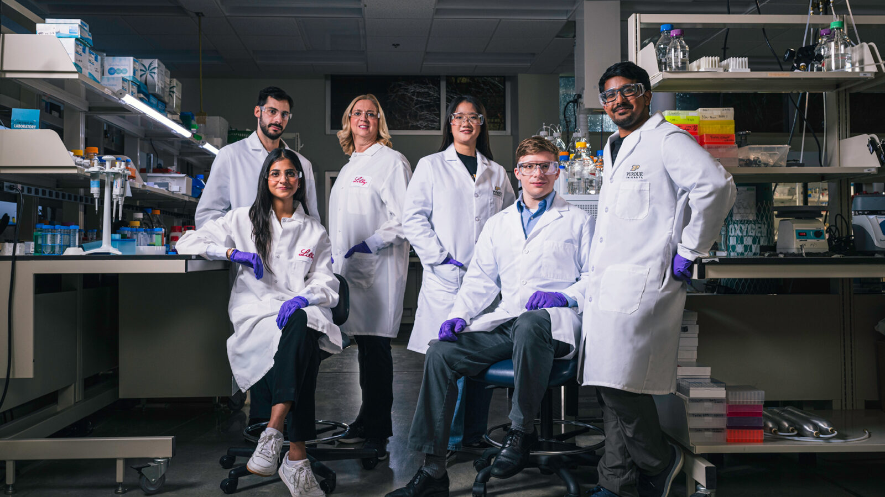

```{=html}
      
<!DOCTYPE html>
<html lang="en">
<head>
<meta charset="UTF-8"/>
<meta name="viewport" content="width=device-width,initial-scale=1.0"/>
<title>RWAA SA Organizational Chart and Expertise Explorer</title>
<style>
  body {font-family:system-ui,sans-serif;background:#fff;color:#1a1a1a;margin:0;padding:1.5rem;}
  .org-title {background:#2C3E50;color:white;text-align:center;font-size:18px;font-weight:500;padding:10px 16px;border-radius:8px;margin-bottom:1rem;}
  .stats-bar {display:flex;gap:10px;flex-wrap:wrap;margin-bottom:1.2rem;}
  .stat-pill {background:#f5f5f5;border:0.5px solid #ddd;border-radius:999px;padding:4px 14px;font-size:13px;color:#555;}
  .stat-pill strong {color:#1a1a1a;}
  .filter-section {margin-bottom:1.2rem;}
  .filter-row {display:flex;gap:6px;flex-wrap:wrap;align-items:center;margin-bottom:6px;}
  .filter-label {font-size:12px;color:#555;font-weight:500;min-width:100px;flex-shrink:0;}
  .filter-btn {font-size:11px;padding:3px 10px;border:0.5px solid #bbb;border-radius:999px;background:transparent;color:#1a1a1a;cursor:pointer;}
  .filter-btn:hover {background:#f0f0f0;}
  .filter-btn.active     {background:#2C3E50;color:#fff;border-color:transparent;}
  .filter-btn.active-user{background:#3b82f6;color:#fff;border-color:transparent;}
  .filter-btn.active-pro {background:#7c3aed;color:#fff;border-color:transparent;}
  .proficiency-row {opacity:0.35;pointer-events:none;transition:opacity 0.2s;}
  .proficiency-row.enabled {opacity:1;pointer-events:all;}
  [data-emp].hidden {display:none!important;}
  .badge-user {font-size:9px;padding:1px 5px;border-radius:999px;background:#dbeafe;color:#1d4ed8;}
  .badge-pro  {font-size:9px;padding:1px 5px;border-radius:999px;background:#ede9fe;color:#6d28d9;}
  .legend {display:flex;gap:14px;flex-wrap:wrap;margin-top:1rem;font-size:12px;color:#666;}
  .legend-item {display:flex;align-items:center;gap:5px;}
  .legend-dot {width:10px;height:10px;border-radius:50%;flex-shrink:0;}
</style>
</head>
<body>
<div class="org-title">RWAA SA Organizational Chart and Expertise Explorer</div>
<div class="filter-section">
  <div class="filter-row">
    <span class="filter-label">Employment:</span>
    <button class="filter-btn active" onclick="setEmp('all',this)">All</button>
    <button class="filter-btn" onclick="setEmp('ft',this)">Full-Time</button>
    <button class="filter-btn" onclick="setEmp('pt',this)">Part-Time</button>
    <button class="filter-btn" onclick="setEmp('ct',this)">Contractors</button>
    <button class="filter-btn active" id="badge-toggle" onclick="toggleBadges(this)" style="margin-left:8px;">Persistent Employment Badge?: On</button>
  </div>
  <div class="filter-row" id="db-row">
    <span class="filter-label">Databases:</span>
    <button class="filter-btn active" onclick="setExpKey('',this)">All</button><button class="filter-btn" onclick="setExpKey('optum',this)">Optum</button><button class="filter-btn" onclick="setExpKey('health_verity',this)">HealthVerity</button><button class="filter-btn" onclick="setExpKey('ibd_plexus',this)">IBD Plexus</button><button class="filter-btn" onclick="setExpKey('komodo',this)">Komodo</button><button class="filter-btn" onclick="setExpKey('truveta',this)">Truveta</button><button class="filter-btn" onclick="setExpKey('flatiron',this)">Flatiron</button><button class="filter-btn" onclick="setExpKey('iqvia',this)">IQVIA</button><button class="filter-btn" onclick="setExpKey('tri_net_x',this)">TriNetX</button><button class="filter-btn" onclick="setExpKey('nhis',this)">NHIS</button><button class="filter-btn" onclick="setExpKey('welldoc',this)">WellDoc</button><button class="filter-btn" onclick="setExpKey('meps',this)">MEPS</button><button class="filter-btn" onclick="setExpKey('nhanes',this)">NHANES</button><button class="filter-btn" onclick="setExpKey('cprd',this)">CPRD</button>
  </div>
  <div class="filter-row" id="tool-row">
    <span class="filter-label">Tools:</span>
    <button class="filter-btn active" onclick="setExpKey('',this)">All</button><button class="filter-btn" onclick="setExpKey('ihd',this)">IHD</button><button class="filter-btn" onclick="setExpKey('aetion',this)">Aetion</button><button class="filter-btn" onclick="setExpKey('sas',this)">SAS</button><button class="filter-btn" onclick="setExpKey('r',this)">R</button>
  </div>
  <div class="filter-row proficiency-row" id="prof-row">
    <span class="filter-label">Proficiency:</span>
    <button class="filter-btn active" onclick="setExpLevel('',this)">All</button>
    <button class="filter-btn" onclick="setExpLevel('user',this)">User</button>
    <button class="filter-btn" onclick="setExpLevel('pro',this)">Professional</button>
  </div>
</div>
<div style="display:grid;grid-template-columns:repeat(5,minmax(0,1fr));gap:10px;margin-bottom:10px;"><div style="border-radius:8px;overflow:hidden;border:0.5px solid rgba(0,0,0,0.12);background:#d0f0e6;"><div style="background:#0F6E56;color:#fff;padding:7px 10px 4px;font-size:12px;font-weight:500;line-height:1.3;">Immunology – HEOR</div><div data-emp="ft" data-optum="2" data-health_verity="2" data-ibd_plexus="1" data-komodo="1" data-truveta="1" data-flatiron="1" data-iqvia="1" data-tri_net_x="1" data-nhis="1" data-welldoc="1" data-meps="1" data-nhanes="1" data-cprd="1" data-ihd="2" data-aetion="1" data-sas="3" data-r="2" style="padding:4px 10px;font-size:12px;font-weight:600;text-align:center;border-bottom:0.5px solid rgba(0,0,0,0.1);color:#1a1a1a;">Hanbo Qiu<span class="exp-badge"></span></div><div style="padding:4px 10px 6px;border-bottom:0.5px solid rgba(0,0,0,0.1);"><div data-emp="ft" data-optum="2" data-health_verity="2" data-ibd_plexus="1" data-komodo="1" data-truveta="1" data-flatiron="1" data-iqvia="1" data-tri_net_x="1" data-nhis="1" data-welldoc="1" data-meps="1" data-nhanes="1" data-cprd="1" data-ihd="1" data-aetion="1" data-sas="3" data-r="1" style="font-size:11.5px;padding:2px 0;line-height:1.5;display:flex;align-items:center;gap:5px;flex-wrap:wrap;color:#1a1a1a;font-weight:600;">Srilatha Yelamanchili<span class="exp-badge"></span></div></div><div style="padding:4px 10px 8px;"><div data-emp="ft" data-optum="3" data-health_verity="2" data-ibd_plexus="1" data-komodo="1" data-truveta="1" data-flatiron="1" data-iqvia="1" data-tri_net_x="1" data-nhis="1" data-welldoc="1" data-meps="1" data-nhanes="1" data-cprd="1" data-ihd="1" data-aetion="1" data-sas="3" data-r="2" style="font-size:11.5px;padding:2px 0;line-height:1.5;display:flex;align-items:center;gap:5px;flex-wrap:wrap;color:#1a1a1a;">Yun Fang<span class="exp-badge"></span></div><div data-emp="ft" data-optum="2" data-health_verity="2" data-ibd_plexus="2" data-komodo="1" data-truveta="1" data-flatiron="1" data-iqvia="1" data-tri_net_x="1" data-nhis="1" data-welldoc="1" data-meps="1" data-nhanes="1" data-cprd="1" data-ihd="1" data-aetion="1" data-sas="3" data-r="2" style="font-size:11.5px;padding:2px 0;line-height:1.5;display:flex;align-items:center;gap:5px;flex-wrap:wrap;color:#1a1a1a;">Guangyong Li<span class="exp-badge"></span></div><div data-emp="ft" data-optum="2" data-health_verity="2" data-ibd_plexus="1" data-komodo="1" data-truveta="1" data-flatiron="1" data-iqvia="1" data-tri_net_x="1" data-nhis="1" data-welldoc="1" data-meps="1" data-nhanes="1" data-cprd="1" data-ihd="1" data-aetion="1" data-sas="3" data-r="2" style="font-size:11.5px;padding:2px 0;line-height:1.5;display:flex;align-items:center;gap:5px;flex-wrap:wrap;color:#1a1a1a;">Zhuowei Wang<span class="exp-badge"></span></div><div data-emp="ft" data-optum="2" data-health_verity="2" data-ibd_plexus="1" data-komodo="1" data-truveta="1" data-flatiron="1" data-iqvia="2" data-tri_net_x="1" data-nhis="1" data-welldoc="1" data-meps="1" data-nhanes="1" data-cprd="1" data-ihd="1" data-aetion="1" data-sas="3" data-r="3" style="font-size:11.5px;padding:2px 0;line-height:1.5;display:flex;align-items:center;gap:5px;flex-wrap:wrap;color:#1a1a1a;">Mohammed Rahman<span class="exp-badge"></span></div><div data-emp="ft" data-optum="2" data-health_verity="1" data-ibd_plexus="1" data-komodo="1" data-truveta="2" data-flatiron="1" data-iqvia="1" data-tri_net_x="1" data-nhis="1" data-welldoc="1" data-meps="1" data-nhanes="1" data-cprd="1" data-ihd="1" data-aetion="1" data-sas="3" data-r="2" style="font-size:11.5px;padding:2px 0;line-height:1.5;display:flex;align-items:center;gap:5px;flex-wrap:wrap;color:#1a1a1a;">Chaoyi Zheng<span class="exp-badge"></span></div></div></div><div style="border-radius:8px;overflow:hidden;border:0.5px solid rgba(0,0,0,0.12);background:#e8e6f9;"><div style="background:#534AB7;color:#fff;padding:7px 10px 4px;font-size:12px;font-weight:500;line-height:1.3;">Neurology – HEOR</div><div data-emp="ft" data-optum="2" data-health_verity="2" data-ibd_plexus="1" data-komodo="1" data-truveta="1" data-flatiron="1" data-iqvia="1" data-tri_net_x="1" data-nhis="1" data-welldoc="1" data-meps="1" data-nhanes="1" data-cprd="1" data-ihd="2" data-aetion="1" data-sas="3" data-r="2" style="padding:4px 10px;font-size:12px;font-weight:600;text-align:center;border-bottom:0.5px solid rgba(0,0,0,0.1);color:#1a1a1a;">Hanbo Qiu<span class="exp-badge"></span></div><div style="padding:4px 10px 6px;border-bottom:0.5px solid rgba(0,0,0,0.1);"><div data-emp="ft" data-optum="2" data-health_verity="2" data-ibd_plexus="1" data-komodo="1" data-truveta="1" data-flatiron="1" data-iqvia="1" data-tri_net_x="1" data-nhis="1" data-welldoc="1" data-meps="1" data-nhanes="2" data-cprd="1" data-ihd="1" data-aetion="1" data-sas="3" data-r="3" style="font-size:11.5px;padding:2px 0;line-height:1.5;display:flex;align-items:center;gap:5px;flex-wrap:wrap;color:#1a1a1a;font-weight:600;">Xueqing Huang<span class="exp-badge"></span></div></div><div style="padding:4px 10px 8px;"><div data-emp="ft" data-optum="2" data-health_verity="2" data-ibd_plexus="1" data-komodo="1" data-truveta="1" data-flatiron="2" data-iqvia="1" data-tri_net_x="1" data-nhis="1" data-welldoc="1" data-meps="2" data-nhanes="2" data-cprd="1" data-ihd="1" data-aetion="1" data-sas="3" data-r="2" style="font-size:11.5px;padding:2px 0;line-height:1.5;display:flex;align-items:center;gap:5px;flex-wrap:wrap;color:#1a1a1a;">Yixun Wu<span class="exp-badge"></span></div><div data-emp="ft" data-optum="2" data-health_verity="2" data-ibd_plexus="1" data-komodo="1" data-truveta="1" data-flatiron="2" data-iqvia="1" data-tri_net_x="1" data-nhis="1" data-welldoc="1" data-meps="1" data-nhanes="1" data-cprd="1" data-ihd="1" data-aetion="1" data-sas="3" data-r="2" style="font-size:11.5px;padding:2px 0;line-height:1.5;display:flex;align-items:center;gap:5px;flex-wrap:wrap;color:#1a1a1a;">Xinran (Flora) Luo<span class="exp-badge"></span></div><div data-emp="ft" data-optum="2" data-health_verity="2" data-ibd_plexus="1" data-komodo="1" data-truveta="1" data-flatiron="1" data-iqvia="1" data-tri_net_x="1" data-nhis="1" data-welldoc="1" data-meps="1" data-nhanes="1" data-cprd="1" data-ihd="1" data-aetion="1" data-sas="3" data-r="3" style="font-size:11.5px;padding:2px 0;line-height:1.5;display:flex;align-items:center;gap:5px;flex-wrap:wrap;color:#1a1a1a;">Yunfei Wang<span class="exp-badge"></span></div><div data-emp="ft" data-optum="2" data-health_verity="1" data-ibd_plexus="1" data-komodo="1" data-truveta="1" data-flatiron="1" data-iqvia="2" data-tri_net_x="1" data-nhis="1" data-welldoc="1" data-meps="1" data-nhanes="2" data-cprd="1" data-ihd="1" data-aetion="1" data-sas="3" data-r="2" style="font-size:11.5px;padding:2px 0;line-height:1.5;display:flex;align-items:center;gap:5px;flex-wrap:wrap;color:#1a1a1a;">Yiyun Ma<span class="exp-badge"></span></div><div data-emp="ft" data-optum="2" data-health_verity="2" data-ibd_plexus="1" data-komodo="1" data-truveta="1" data-flatiron="1" data-iqvia="1" data-tri_net_x="1" data-nhis="1" data-welldoc="1" data-meps="1" data-nhanes="1" data-cprd="1" data-ihd="1" data-aetion="1" data-sas="3" data-r="2" style="font-size:11.5px;padding:2px 0;line-height:1.5;display:flex;align-items:center;gap:5px;flex-wrap:wrap;color:#1a1a1a;">Max Lyu<span class="exp-badge"></span></div></div></div><div style="border-radius:8px;overflow:hidden;border:0.5px solid rgba(0,0,0,0.12);background:#daeeff;"><div style="background:#185FA5;color:#fff;padding:7px 10px 4px;font-size:12px;font-weight:500;line-height:1.3;">CMH – HEOR &amp; <span style="color:#ff6b6b;">GPS</span></div><div data-emp="ft" data-optum="2" data-health_verity="2" data-ibd_plexus="1" data-komodo="1" data-truveta="2" data-flatiron="2" data-iqvia="1" data-tri_net_x="1" data-nhis="1" data-welldoc="2" data-meps="1" data-nhanes="2" data-cprd="1" data-ihd="2" data-aetion="1" data-sas="3" data-r="2" style="padding:4px 10px;font-size:12px;font-weight:600;text-align:center;border-bottom:0.5px solid rgba(0,0,0,0.1);color:#CC0000;">Tianshu Feng<span class="exp-badge"></span></div><div style="padding:4px 10px 6px;border-bottom:0.5px solid rgba(0,0,0,0.1);"><div data-emp="ft" data-optum="3" data-health_verity="1" data-ibd_plexus="1" data-komodo="1" data-truveta="3" data-flatiron="1" data-iqvia="1" data-tri_net_x="1" data-nhis="1" data-welldoc="1" data-meps="1" data-nhanes="1" data-cprd="1" data-ihd="1" data-aetion="1" data-sas="3" data-r="3" style="font-size:11.5px;padding:2px 0;line-height:1.5;display:flex;align-items:center;gap:5px;flex-wrap:wrap;color:#1a1a1a;font-weight:600;">Christi Kao<span class="exp-badge"></span></div><div data-emp="ft" data-optum="3" data-health_verity="1" data-ibd_plexus="1" data-komodo="1" data-truveta="1" data-flatiron="1" data-iqvia="1" data-tri_net_x="1" data-nhis="1" data-welldoc="1" data-meps="1" data-nhanes="1" data-cprd="2" data-ihd="1" data-aetion="1" data-sas="3" data-r="1" style="font-size:11.5px;padding:2px 0;line-height:1.5;display:flex;align-items:center;gap:5px;flex-wrap:wrap;color:#1a1a1a;font-weight:600;">Dongju Liu<span class="exp-badge"></span></div></div><div style="padding:4px 10px 8px;"><div data-emp="ft" data-optum="3" data-health_verity="2" data-ibd_plexus="1" data-komodo="1" data-truveta="1" data-flatiron="1" data-iqvia="1" data-tri_net_x="1" data-nhis="1" data-welldoc="2" data-meps="2" data-nhanes="3" data-cprd="2" data-ihd="1" data-aetion="1" data-sas="3" data-r="2" style="font-size:11.5px;padding:2px 0;line-height:1.5;display:flex;align-items:center;gap:5px;flex-wrap:wrap;color:#1a1a1a;">Melody Dehghan<span class="exp-badge"></span></div><div data-emp="ft" data-optum="3" data-health_verity="2" data-ibd_plexus="1" data-komodo="1" data-truveta="1" data-flatiron="1" data-iqvia="2" data-tri_net_x="1" data-nhis="1" data-welldoc="1" data-meps="1" data-nhanes="2" data-cprd="2" data-ihd="1" data-aetion="1" data-sas="3" data-r="3" style="font-size:11.5px;padding:2px 0;line-height:1.5;display:flex;align-items:center;gap:5px;flex-wrap:wrap;color:#1a1a1a;">Frank Cao<span class="exp-badge"></span></div><div data-emp="ft" data-optum="3" data-health_verity="2" data-ibd_plexus="1" data-komodo="2" data-truveta="1" data-flatiron="1" data-iqvia="1" data-tri_net_x="1" data-nhis="1" data-welldoc="1" data-meps="1" data-nhanes="2" data-cprd="1" data-ihd="1" data-aetion="1" data-sas="3" data-r="3" style="font-size:11.5px;padding:2px 0;line-height:1.5;display:flex;align-items:center;gap:5px;flex-wrap:wrap;color:#1a1a1a;">Pedram Azimzadeh<span class="exp-badge"></span></div><div data-emp="ft" data-optum="3" data-health_verity="1" data-ibd_plexus="1" data-komodo="1" data-truveta="1" data-flatiron="1" data-iqvia="1" data-tri_net_x="1" data-nhis="1" data-welldoc="2" data-meps="1" data-nhanes="2" data-cprd="2" data-ihd="1" data-aetion="1" data-sas="3" data-r="2" style="font-size:11.5px;padding:2px 0;line-height:1.5;display:flex;align-items:center;gap:5px;flex-wrap:wrap;color:#1a1a1a;">Alice Li<span class="exp-badge"></span></div><div data-emp="ft" data-optum="2" data-health_verity="1" data-ibd_plexus="2" data-komodo="1" data-truveta="1" data-flatiron="1" data-iqvia="2" data-tri_net_x="1" data-nhis="1" data-welldoc="1" data-meps="1" data-nhanes="1" data-cprd="1" data-ihd="3" data-aetion="1" data-sas="3" data-r="1" style="font-size:11.5px;padding:2px 0;line-height:1.5;display:flex;align-items:center;gap:5px;flex-wrap:wrap;color:#1a1a1a;">Debbie Tinsley<span class="exp-badge"></span></div><div data-emp="ft" data-optum="3" data-health_verity="2" data-ibd_plexus="1" data-komodo="1" data-truveta="1" data-flatiron="1" data-iqvia="1" data-tri_net_x="1" data-nhis="1" data-welldoc="1" data-meps="1" data-nhanes="1" data-cprd="2" data-ihd="3" data-aetion="2" data-sas="3" data-r="1" style="font-size:11.5px;padding:2px 0;line-height:1.5;display:flex;align-items:center;gap:5px;flex-wrap:wrap;color:#1a1a1a;">Alexandra (Zan) Meeks<span class="exp-badge"></span></div><div data-emp="ft" data-optum="3" data-health_verity="2" data-ibd_plexus="1" data-komodo="1" data-truveta="1" data-flatiron="2" data-iqvia="2" data-tri_net_x="1" data-nhis="2" data-welldoc="1" data-meps="2" data-nhanes="2" data-cprd="1" data-ihd="2" data-aetion="1" data-sas="3" data-r="2" style="font-size:11.5px;padding:2px 0;line-height:1.5;display:flex;align-items:center;gap:5px;flex-wrap:wrap;color:#1a1a1a;">Sean He<span class="exp-badge"></span></div><div data-emp="ft" data-optum="1" data-health_verity="1" data-ibd_plexus="1" data-komodo="1" data-truveta="1" data-flatiron="1" data-iqvia="1" data-tri_net_x="1" data-nhis="1" data-welldoc="1" data-meps="1" data-nhanes="1" data-cprd="1" data-ihd="1" data-aetion="1" data-sas="3" data-r="1" style="font-size:11.5px;padding:2px 0;line-height:1.5;display:flex;align-items:center;gap:5px;flex-wrap:wrap;color:#1a1a1a;">Zheng Gu<span class="exp-badge"></span></div><div data-emp="ft" data-optum="1" data-health_verity="1" data-ibd_plexus="1" data-komodo="1" data-truveta="1" data-flatiron="1" data-iqvia="1" data-tri_net_x="1" data-nhis="1" data-welldoc="1" data-meps="1" data-nhanes="1" data-cprd="1" data-ihd="1" data-aetion="1" data-sas="1" data-r="1" style="font-size:11.5px;padding:2px 0;line-height:1.5;display:flex;align-items:center;gap:5px;flex-wrap:wrap;color:#1a1a1a;">Xutong Li<span class="exp-badge"></span></div><div data-emp="pt" data-optum="2" data-health_verity="1" data-ibd_plexus="1" data-komodo="1" data-truveta="1" data-flatiron="1" data-iqvia="1" data-tri_net_x="1" data-nhis="1" data-welldoc="1" data-meps="1" data-nhanes="1" data-cprd="1" data-ihd="1" data-aetion="1" data-sas="3" data-r="3" style="font-size:11.5px;padding:2px 0;line-height:1.5;display:flex;align-items:center;gap:5px;flex-wrap:wrap;color:#1a1a1a;">Lian Duan<span class="emp-badge" style="font-size:9px;padding:1px 5px;border-radius:999px;background:#e0f2ee;color:#0F6E56;">Part-Time</span><span class="exp-badge"></span></div></div></div><div style="border-radius:8px;overflow:hidden;border:0.5px solid rgba(0,0,0,0.12);background:#fde8df;"><div style="background:#993C1D;color:#fff;padding:7px 10px 4px;font-size:12px;font-weight:500;line-height:1.3;">Oncology – HEOR &amp; <span style="color:#ff6b6b;">GPS</span></div><div data-emp="ft" data-optum="3" data-health_verity="2" data-ibd_plexus="1" data-komodo="1" data-truveta="1" data-flatiron="3" data-iqvia="2" data-tri_net_x="2" data-nhis="1" data-welldoc="1" data-meps="1" data-nhanes="1" data-cprd="2" data-ihd="2" data-aetion="1" data-sas="3" data-r="3" style="padding:4px 10px;font-size:12px;font-weight:600;text-align:center;border-bottom:0.5px solid rgba(0,0,0,0.1);color:#CC0000;">Yimei Han<span class="exp-badge"></span></div><div style="padding:4px 10px 6px;border-bottom:0.5px solid rgba(0,0,0,0.1);"><div data-emp="ft" data-optum="3" data-health_verity="2" data-ibd_plexus="1" data-komodo="1" data-truveta="1" data-flatiron="3" data-iqvia="1" data-tri_net_x="1" data-nhis="1" data-welldoc="1" data-meps="1" data-nhanes="1" data-cprd="1" data-ihd="1" data-aetion="1" data-sas="3" data-r="2" style="font-size:11.5px;padding:2px 0;line-height:1.5;display:flex;align-items:center;gap:5px;flex-wrap:wrap;color:#1a1a1a;font-weight:600;">Xiaohong (Ivy) Li<span class="exp-badge"></span></div><div data-emp="ft" data-optum="2" data-health_verity="2" data-ibd_plexus="1" data-komodo="1" data-truveta="1" data-flatiron="3" data-iqvia="2" data-tri_net_x="1" data-nhis="1" data-welldoc="1" data-meps="1" data-nhanes="1" data-cprd="1" data-ihd="1" data-aetion="1" data-sas="3" data-r="3" style="font-size:11.5px;padding:2px 0;line-height:1.5;display:flex;align-items:center;gap:5px;flex-wrap:wrap;color:#1a1a1a;font-weight:600;">Baoyi Feng<span class="exp-badge"></span></div><div data-emp="ft" data-optum="1" data-health_verity="1" data-ibd_plexus="1" data-komodo="1" data-truveta="1" data-flatiron="1" data-iqvia="1" data-tri_net_x="1" data-nhis="1" data-welldoc="1" data-meps="1" data-nhanes="1" data-cprd="1" data-ihd="1" data-aetion="1" data-sas="1" data-r="1" style="font-size:11.5px;padding:2px 0;line-height:1.5;display:flex;align-items:center;gap:5px;flex-wrap:wrap;color:#1a1a1a;font-weight:600;">Patrick Li<span class="exp-badge"></span></div><div data-emp="ft" data-optum="2" data-health_verity="1" data-ibd_plexus="1" data-komodo="1" data-truveta="1" data-flatiron="2" data-iqvia="1" data-tri_net_x="1" data-nhis="1" data-welldoc="1" data-meps="1" data-nhanes="1" data-cprd="1" data-ihd="2" data-aetion="1" data-sas="2" data-r="3" style="font-size:11.5px;padding:2px 0;line-height:1.5;display:flex;align-items:center;gap:5px;flex-wrap:wrap;color:#1a1a1a;font-weight:600;">Zhenhui Xu<span class="exp-badge"></span></div></div><div style="padding:4px 10px 8px;"><div data-emp="ft" data-optum="3" data-health_verity="1" data-ibd_plexus="1" data-komodo="1" data-truveta="1" data-flatiron="3" data-iqvia="3" data-tri_net_x="1" data-nhis="1" data-welldoc="1" data-meps="1" data-nhanes="1" data-cprd="2" data-ihd="1" data-aetion="1" data-sas="3" data-r="2" style="font-size:11.5px;padding:2px 0;line-height:1.5;display:flex;align-items:center;gap:5px;flex-wrap:wrap;color:#1a1a1a;">Tomoko Sugihara<span class="exp-badge"></span></div></div></div><div style="border-radius:8px;overflow:hidden;border:0.5px solid rgba(0,0,0,0.12);background:#fdf0d5;"><div style="background:#854F0B;color:#fff;padding:7px 10px 4px;font-size:12px;font-weight:500;line-height:1.3;">Capabilities – All &amp; <span style="color:#ff6b6b;">GPS</span></div><div data-emp="ft" data-optum="2" data-health_verity="1" data-ibd_plexus="1" data-komodo="1" data-truveta="1" data-flatiron="1" data-iqvia="1" data-tri_net_x="1" data-nhis="1" data-welldoc="1" data-meps="1" data-nhanes="1" data-cprd="1" data-ihd="1" data-aetion="1" data-sas="1" data-r="3" style="padding:4px 10px;font-size:12px;font-weight:600;text-align:center;border-bottom:0.5px solid rgba(0,0,0,0.1);color:#CC0000;">Andy Dang<span class="exp-badge"></span></div><div style="padding:4px 10px 6px;border-bottom:0.5px solid rgba(0,0,0,0.1);"><div data-emp="ft" data-optum="2" data-health_verity="1" data-ibd_plexus="1" data-komodo="1" data-truveta="1" data-flatiron="1" data-iqvia="1" data-tri_net_x="1" data-nhis="1" data-welldoc="1" data-meps="1" data-nhanes="1" data-cprd="1" data-ihd="1" data-aetion="1" data-sas="1" data-r="3" style="font-size:11.5px;padding:2px 0;line-height:1.5;display:flex;align-items:center;gap:5px;flex-wrap:wrap;color:#1a1a1a;font-weight:600;">Andy Dang<span class="exp-badge"></span></div><div data-emp="ft" data-optum="2" data-health_verity="2" data-ibd_plexus="2" data-komodo="1" data-truveta="2" data-flatiron="1" data-iqvia="2" data-tri_net_x="1" data-nhis="1" data-welldoc="1" data-meps="1" data-nhanes="1" data-cprd="1" data-ihd="1" data-aetion="2" data-sas="3" data-r="3" style="font-size:11.5px;padding:2px 0;line-height:1.5;display:flex;align-items:center;gap:5px;flex-wrap:wrap;color:#1a1a1a;font-weight:600;">Yifei Zhang<span class="exp-badge"></span></div><div data-emp="ct" data-optum="2" data-health_verity="1" data-ibd_plexus="1" data-komodo="2" data-truveta="2" data-flatiron="2" data-iqvia="1" data-tri_net_x="1" data-nhis="1" data-welldoc="1" data-meps="1" data-nhanes="2" data-cprd="1" data-ihd="1" data-aetion="1" data-sas="3" data-r="3" style="font-size:11.5px;padding:2px 0;line-height:1.5;display:flex;align-items:center;gap:5px;flex-wrap:wrap;color:#1a1a1a;font-weight:600;">Jake William Coldiron<span class="emp-badge" style="font-size:9px;padding:1px 5px;border-radius:999px;background:#fff3e0;color:#854F0B;">Contractor</span><span class="exp-badge"></span></div></div><div style="padding:4px 10px 8px;"><div data-emp="ft" data-optum="2" data-health_verity="1" data-ibd_plexus="1" data-komodo="1" data-truveta="1" data-flatiron="3" data-iqvia="2" data-tri_net_x="1" data-nhis="1" data-welldoc="1" data-meps="1" data-nhanes="1" data-cprd="1" data-ihd="1" data-aetion="1" data-sas="3" data-r="1" style="font-size:11.5px;padding:2px 0;line-height:1.5;display:flex;align-items:center;gap:5px;flex-wrap:wrap;color:#1a1a1a;">Dan He<span class="exp-badge"></span></div><div data-emp="ft" data-optum="2" data-health_verity="2" data-ibd_plexus="1" data-komodo="1" data-truveta="1" data-flatiron="1" data-iqvia="1" data-tri_net_x="1" data-nhis="1" data-welldoc="1" data-meps="1" data-nhanes="1" data-cprd="1" data-ihd="1" data-aetion="1" data-sas="3" data-r="2" style="font-size:11.5px;padding:2px 0;line-height:1.5;display:flex;align-items:center;gap:5px;flex-wrap:wrap;color:#1a1a1a;">Max Lyu<span class="exp-badge"></span></div></div></div></div>
<div style="display:grid;grid-template-columns:repeat(5,minmax(0,1fr));gap:10px;margin-bottom:10px;"><div style="border-radius:8px;overflow:hidden;border:0.5px solid rgba(0,0,0,0.12);background:#d0f0e6;"><div style="background:#0F6E56;color:#fff;padding:7px 10px 4px;font-size:12px;font-weight:500;line-height:1.3;">Immunology – HTA</div><div data-emp="ft" data-optum="3" data-health_verity="1" data-ibd_plexus="1" data-komodo="2" data-truveta="1" data-flatiron="1" data-iqvia="2" data-tri_net_x="1" data-nhis="1" data-welldoc="1" data-meps="1" data-nhanes="1" data-cprd="1" data-ihd="2" data-aetion="1" data-sas="3" data-r="2" style="padding:4px 10px;font-size:12px;font-weight:600;text-align:center;border-bottom:0.5px solid rgba(0,0,0,0.1);color:#1a1a1a;">Lili Huang<span class="exp-badge"></span></div><div style="padding:4px 10px 8px;"><div data-emp="ft" data-optum="1" data-health_verity="1" data-ibd_plexus="1" data-komodo="1" data-truveta="1" data-flatiron="1" data-iqvia="1" data-tri_net_x="1" data-nhis="1" data-welldoc="1" data-meps="1" data-nhanes="1" data-cprd="1" data-ihd="1" data-aetion="1" data-sas="3" data-r="2" style="font-size:11.5px;padding:2px 0;line-height:1.5;display:flex;align-items:center;gap:5px;flex-wrap:wrap;color:#1a1a1a;">Fei Xu<span class="exp-badge"></span></div></div></div><div style="border-radius:8px;overflow:hidden;border:0.5px solid rgba(0,0,0,0.12);background:#e8e6f9;"><div style="background:#534AB7;color:#fff;padding:7px 10px 4px;font-size:12px;font-weight:500;line-height:1.3;">Neurology – HTA &amp; <span style="color:#ff6b6b;">GPS</span></div><div data-emp="ft" data-optum="1" data-health_verity="2" data-ibd_plexus="1" data-komodo="1" data-truveta="1" data-flatiron="1" data-iqvia="1" data-tri_net_x="1" data-nhis="1" data-welldoc="1" data-meps="1" data-nhanes="2" data-cprd="1" data-ihd="1" data-aetion="1" data-sas="3" data-r="3" style="padding:4px 10px;font-size:12px;font-weight:600;text-align:center;border-bottom:0.5px solid rgba(0,0,0,0.1);color:#CC0000;">Carol Qiao<span class="exp-badge"></span></div><div style="padding:4px 10px 8px;"><div data-emp="ft" data-optum="1" data-health_verity="2" data-ibd_plexus="1" data-komodo="1" data-truveta="1" data-flatiron="1" data-iqvia="1" data-tri_net_x="2" data-nhis="1" data-welldoc="1" data-meps="1" data-nhanes="1" data-cprd="1" data-ihd="1" data-aetion="1" data-sas="3" data-r="2" style="font-size:11.5px;padding:2px 0;line-height:1.5;display:flex;align-items:center;gap:5px;flex-wrap:wrap;color:#1a1a1a;">Ying Jing<span class="exp-badge"></span></div><div data-emp="ft" data-optum="1" data-health_verity="2" data-ibd_plexus="1" data-komodo="1" data-truveta="1" data-flatiron="1" data-iqvia="1" data-tri_net_x="1" data-nhis="1" data-welldoc="1" data-meps="1" data-nhanes="2" data-cprd="1" data-ihd="1" data-aetion="1" data-sas="3" data-r="3" style="font-size:11.5px;padding:2px 0;line-height:1.5;display:flex;align-items:center;gap:5px;flex-wrap:wrap;color:#1a1a1a;">Peggy Lin<span class="exp-badge"></span></div><div data-emp="ft" data-optum="1" data-health_verity="1" data-ibd_plexus="1" data-komodo="1" data-truveta="1" data-flatiron="1" data-iqvia="1" data-tri_net_x="1" data-nhis="1" data-welldoc="1" data-meps="1" data-nhanes="1" data-cprd="1" data-ihd="1" data-aetion="1" data-sas="3" data-r="3" style="font-size:11.5px;padding:2px 0;line-height:1.5;display:flex;align-items:center;gap:5px;flex-wrap:wrap;color:#1a1a1a;">Xuan Wei<span class="exp-badge"></span></div></div></div><div style="border-radius:8px;overflow:hidden;border:0.5px solid rgba(0,0,0,0.12);background:#daeeff;"><div style="background:#185FA5;color:#fff;padding:7px 10px 4px;font-size:12px;font-weight:500;line-height:1.3;">CMH – HTA</div><div data-emp="ft" data-optum="2" data-health_verity="1" data-ibd_plexus="1" data-komodo="1" data-truveta="1" data-flatiron="1" data-iqvia="1" data-tri_net_x="1" data-nhis="1" data-welldoc="1" data-meps="1" data-nhanes="1" data-cprd="1" data-ihd="1" data-aetion="1" data-sas="1" data-r="1" style="padding:4px 10px;font-size:12px;font-weight:600;text-align:center;border-bottom:0.5px solid rgba(0,0,0,0.1);color:#1a1a1a;">Steve Zheng<span class="exp-badge"></span></div><div style="padding:4px 10px 6px;border-bottom:0.5px solid rgba(0,0,0,0.1);"><div data-emp="ft" data-optum="2" data-health_verity="2" data-ibd_plexus="1" data-komodo="1" data-truveta="2" data-flatiron="1" data-iqvia="1" data-tri_net_x="3" data-nhis="1" data-welldoc="1" data-meps="1" data-nhanes="1" data-cprd="1" data-ihd="1" data-aetion="1" data-sas="3" data-r="2" style="font-size:11.5px;padding:2px 0;line-height:1.5;display:flex;align-items:center;gap:5px;flex-wrap:wrap;color:#1a1a1a;font-weight:600;">Ying Fang<span class="exp-badge"></span></div><div data-emp="ft" data-optum="2" data-health_verity="1" data-ibd_plexus="1" data-komodo="1" data-truveta="1" data-flatiron="1" data-iqvia="1" data-tri_net_x="1" data-nhis="1" data-welldoc="3" data-meps="1" data-nhanes="3" data-cprd="1" data-ihd="1" data-aetion="2" data-sas="3" data-r="3" style="font-size:11.5px;padding:2px 0;line-height:1.5;display:flex;align-items:center;gap:5px;flex-wrap:wrap;color:#1a1a1a;font-weight:600;">Yeran Tong<span class="exp-badge"></span></div></div><div style="padding:4px 10px 8px;"><div data-emp="ft" data-optum="1" data-health_verity="1" data-ibd_plexus="1" data-komodo="1" data-truveta="1" data-flatiron="1" data-iqvia="1" data-tri_net_x="1" data-nhis="1" data-welldoc="1" data-meps="1" data-nhanes="1" data-cprd="1" data-ihd="1" data-aetion="1" data-sas="3" data-r="3" style="font-size:11.5px;padding:2px 0;line-height:1.5;display:flex;align-items:center;gap:5px;flex-wrap:wrap;color:#1a1a1a;">Junyuan Zheng<span class="exp-badge"></span></div><div data-emp="ft" data-optum="1" data-health_verity="1" data-ibd_plexus="1" data-komodo="1" data-truveta="1" data-flatiron="1" data-iqvia="1" data-tri_net_x="1" data-nhis="1" data-welldoc="1" data-meps="1" data-nhanes="1" data-cprd="1" data-ihd="1" data-aetion="1" data-sas="1" data-r="1" style="font-size:11.5px;padding:2px 0;line-height:1.5;display:flex;align-items:center;gap:5px;flex-wrap:wrap;color:#1a1a1a;">Thomas Huang<span class="exp-badge"></span></div><div data-emp="ft" data-optum="1" data-health_verity="1" data-ibd_plexus="1" data-komodo="1" data-truveta="1" data-flatiron="1" data-iqvia="1" data-tri_net_x="1" data-nhis="1" data-welldoc="1" data-meps="1" data-nhanes="1" data-cprd="1" data-ihd="1" data-aetion="1" data-sas="3" data-r="3" style="font-size:11.5px;padding:2px 0;line-height:1.5;display:flex;align-items:center;gap:5px;flex-wrap:wrap;color:#1a1a1a;">Bo Ma<span class="exp-badge"></span></div><div data-emp="ft" data-optum="1" data-health_verity="1" data-ibd_plexus="1" data-komodo="1" data-truveta="1" data-flatiron="1" data-iqvia="1" data-tri_net_x="1" data-nhis="1" data-welldoc="1" data-meps="1" data-nhanes="1" data-cprd="1" data-ihd="1" data-aetion="1" data-sas="1" data-r="1" style="font-size:11.5px;padding:2px 0;line-height:1.5;display:flex;align-items:center;gap:5px;flex-wrap:wrap;color:#1a1a1a;">Elaine Lui<span class="exp-badge"></span></div><div data-emp="ft" data-optum="1" data-health_verity="1" data-ibd_plexus="1" data-komodo="1" data-truveta="1" data-flatiron="1" data-iqvia="1" data-tri_net_x="1" data-nhis="1" data-welldoc="1" data-meps="1" data-nhanes="1" data-cprd="1" data-ihd="1" data-aetion="1" data-sas="3" data-r="2" style="font-size:11.5px;padding:2px 0;line-height:1.5;display:flex;align-items:center;gap:5px;flex-wrap:wrap;color:#1a1a1a;">Peng Du<span class="exp-badge"></span></div><div data-emp="pt" data-optum="1" data-health_verity="1" data-ibd_plexus="1" data-komodo="1" data-truveta="1" data-flatiron="1" data-iqvia="1" data-tri_net_x="1" data-nhis="1" data-welldoc="1" data-meps="1" data-nhanes="1" data-cprd="1" data-ihd="1" data-aetion="1" data-sas="3" data-r="3" style="font-size:11.5px;padding:2px 0;line-height:1.5;display:flex;align-items:center;gap:5px;flex-wrap:wrap;color:#1a1a1a;">Zbigniew Kadziola<span class="emp-badge" style="font-size:9px;padding:1px 5px;border-radius:999px;background:#e0f2ee;color:#0F6E56;">Part-Time</span><span class="exp-badge"></span></div><div data-emp="ft" data-optum="1" data-health_verity="1" data-ibd_plexus="1" data-komodo="1" data-truveta="1" data-flatiron="1" data-iqvia="1" data-tri_net_x="1" data-nhis="1" data-welldoc="1" data-meps="1" data-nhanes="1" data-cprd="1" data-ihd="1" data-aetion="1" data-sas="3" data-r="3" style="font-size:11.5px;padding:2px 0;line-height:1.5;display:flex;align-items:center;gap:5px;flex-wrap:wrap;color:#1a1a1a;">Xiaoliu Xu<span class="exp-badge"></span></div></div></div><div style="border-radius:8px;overflow:hidden;border:0.5px solid rgba(0,0,0,0.12);background:#fde8df;"><div style="background:#993C1D;color:#fff;padding:7px 10px 4px;font-size:12px;font-weight:500;line-height:1.3;">Oncology – HTA &amp; <span style="color:#ff6b6b;">GPS</span></div><div data-emp="ft" data-optum="3" data-health_verity="2" data-ibd_plexus="1" data-komodo="1" data-truveta="1" data-flatiron="3" data-iqvia="2" data-tri_net_x="2" data-nhis="1" data-welldoc="1" data-meps="1" data-nhanes="1" data-cprd="2" data-ihd="2" data-aetion="1" data-sas="3" data-r="3" style="padding:4px 10px;font-size:12px;font-weight:600;text-align:center;border-bottom:0.5px solid rgba(0,0,0,0.1);color:#CC0000;">Yimei Han<span class="exp-badge"></span></div><div style="padding:4px 10px 6px;border-bottom:0.5px solid rgba(0,0,0,0.1);"><div data-emp="ft" data-optum="1" data-health_verity="2" data-ibd_plexus="1" data-komodo="1" data-truveta="1" data-flatiron="2" data-iqvia="2" data-tri_net_x="1" data-nhis="1" data-welldoc="1" data-meps="1" data-nhanes="1" data-cprd="1" data-ihd="1" data-aetion="1" data-sas="3" data-r="3" style="font-size:11.5px;padding:2px 0;line-height:1.5;display:flex;align-items:center;gap:5px;flex-wrap:wrap;color:#1a1a1a;font-weight:600;">Frank Tian<span class="exp-badge"></span></div><div data-emp="ft" data-optum="1" data-health_verity="1" data-ibd_plexus="1" data-komodo="1" data-truveta="1" data-flatiron="2" data-iqvia="1" data-tri_net_x="1" data-nhis="1" data-welldoc="1" data-meps="1" data-nhanes="2" data-cprd="1" data-ihd="1" data-aetion="1" data-sas="2" data-r="3" style="font-size:11.5px;padding:2px 0;line-height:1.5;display:flex;align-items:center;gap:5px;flex-wrap:wrap;color:#1a1a1a;font-weight:600;">Ziwei Zhang<span class="exp-badge"></span></div><div data-emp="ft" data-optum="1" data-health_verity="1" data-ibd_plexus="1" data-komodo="1" data-truveta="1" data-flatiron="2" data-iqvia="1" data-tri_net_x="1" data-nhis="1" data-welldoc="1" data-meps="1" data-nhanes="1" data-cprd="1" data-ihd="1" data-aetion="1" data-sas="3" data-r="3" style="font-size:11.5px;padding:2px 0;line-height:1.5;display:flex;align-items:center;gap:5px;flex-wrap:wrap;color:#1a1a1a;font-weight:600;">Noah Seethaler<span class="exp-badge"></span></div></div><div style="padding:4px 10px 8px;"><div data-emp="ft" data-optum="1" data-health_verity="1" data-ibd_plexus="1" data-komodo="1" data-truveta="1" data-flatiron="1" data-iqvia="1" data-tri_net_x="1" data-nhis="1" data-welldoc="1" data-meps="1" data-nhanes="1" data-cprd="1" data-ihd="1" data-aetion="1" data-sas="1" data-r="1" style="font-size:11.5px;padding:2px 0;line-height:1.5;display:flex;align-items:center;gap:5px;flex-wrap:wrap;color:#1a1a1a;">Yueyi Xue<span class="exp-badge"></span></div><div data-emp="ft" data-optum="1" data-health_verity="1" data-ibd_plexus="1" data-komodo="1" data-truveta="1" data-flatiron="1" data-iqvia="1" data-tri_net_x="1" data-nhis="1" data-welldoc="1" data-meps="1" data-nhanes="1" data-cprd="1" data-ihd="1" data-aetion="1" data-sas="1" data-r="1" style="font-size:11.5px;padding:2px 0;line-height:1.5;display:flex;align-items:center;gap:5px;flex-wrap:wrap;color:#1a1a1a;">Guangyu Xu<span class="exp-badge"></span></div><div data-emp="ft" data-optum="1" data-health_verity="1" data-ibd_plexus="1" data-komodo="1" data-truveta="1" data-flatiron="1" data-iqvia="1" data-tri_net_x="1" data-nhis="1" data-welldoc="1" data-meps="1" data-nhanes="2" data-cprd="1" data-ihd="1" data-aetion="1" data-sas="3" data-r="2" style="font-size:11.5px;padding:2px 0;line-height:1.5;display:flex;align-items:center;gap:5px;flex-wrap:wrap;color:#1a1a1a;">Quan Yuan<span class="exp-badge"></span></div></div></div><div></div></div>
<div class="legend">
  <div class="legend-item"><div class="legend-dot" style="background:#0F6E56;"></div> Immunology</div>
  <div class="legend-item"><div class="legend-dot" style="background:#185FA5;"></div> CMH</div>
  <div class="legend-item"><div class="legend-dot" style="background:#534AB7;"></div> Neurology</div>
  <div class="legend-item"><div class="legend-dot" style="background:#993C1D;"></div> Oncology</div>
  <div class="legend-item"><div class="legend-dot" style="background:#854F0B;"></div> Capabilities</div>
  <div class="legend-item"><div class="legend-dot" style="background:#CC0000;"></div> GPS-aligned head</div>
</div>
<script>
let empFilter = 'all';
let expKey    = '';
let expLevel  = '';
 
function toggleBadges(btn) {
  const visible = btn.textContent.includes('On');
  document.querySelectorAll('.emp-badge').forEach(b => b.style.display = visible ? 'none' : '');
  btn.textContent = visible ? 'Persistent Employment Badge?: Off' : 'Persistent Employment Badge?: On';
  btn.classList.toggle('active', !visible);
}
 
function setEmp(type, btn) {
  document.querySelectorAll('[onclick^="setEmp"]').forEach(b => b.classList.remove('active'));
  btn.classList.add('active');
  empFilter = type;
  apply();
}
 
function setExpKey(key, btn) {
  // Clear active from both db and tool rows
  document.querySelectorAll('#db-row .filter-btn, #tool-row .filter-btn').forEach(b => b.classList.remove('active','active-user','active-pro'));
  btn.classList.add('active');
  expKey = key;
  // Enable/disable proficiency row
  const profRow = document.getElementById('prof-row');
  if (key) {
    profRow.classList.add('enabled');
  } else {
    profRow.classList.remove('enabled');
    expLevel = '';
    document.querySelectorAll('#prof-row .filter-btn').forEach((b,i) => b.classList.toggle('active', i===0));
  }
  apply();
}
 
function setExpLevel(level, btn) {
  document.querySelectorAll('#prof-row .filter-btn').forEach(b => b.classList.remove('active','active-user','active-pro'));
  if (!level) { btn.classList.add('active'); }
  else { btn.classList.add(level === 'pro' ? 'active-pro' : 'active-user'); }
  expLevel = level;
  apply();
}
 
function apply() {
  document.querySelectorAll('[data-emp]').forEach(el => {
    let show = true;
    if (empFilter !== 'all' && el.dataset.emp !== empFilter) show = false;
    if (expKey) {
      const val = parseInt(el.dataset[expKey] || '1');
      if (expLevel === 'user' && val < 2) show = false;
      if (expLevel === 'pro'  && val < 3) show = false;
    }
    el.classList.toggle('hidden', !show);
    const badge = el.querySelector('.exp-badge');
    if (badge) {
      badge.className = 'exp-badge';
      badge.textContent = '';
      if (expKey && !el.classList.contains('hidden')) {
        const val = parseInt(el.dataset[expKey] || '1');
        if (val >= 3)      { badge.className = 'exp-badge badge-pro';  badge.textContent = 'Professional'; }
        else if (val === 2) { badge.className = 'exp-badge badge-user'; badge.textContent = 'User'; }
      }
    }
  });
}
</script>
</body>
</html>

```

---

<div style="text-align: center; margin-top: 1.5rem;">

  <p style="margin-top: 1rem;"><em>"The people who make up this company are its most valuable assets."</em><br> J.K. Lilly, Jr., 1950 (approx.)</p>
</div>
